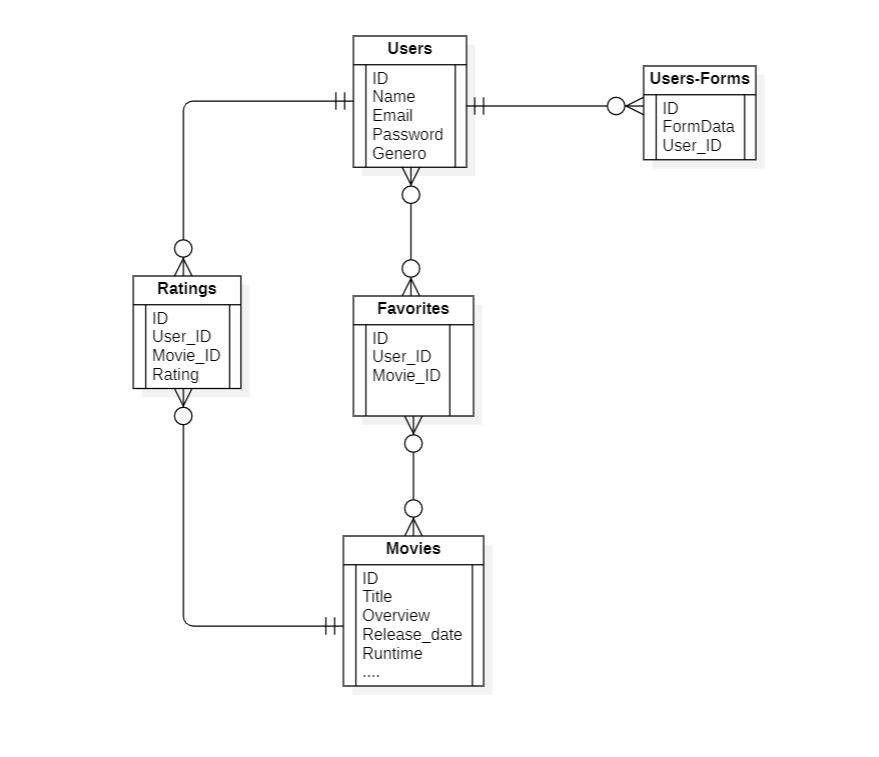
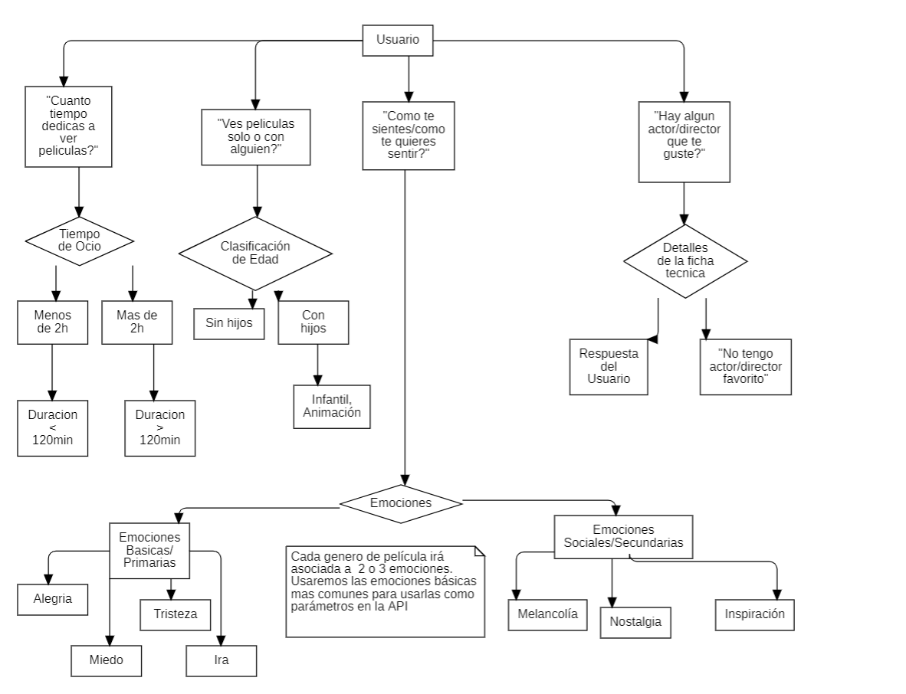

# MOVIE MATCH: 'Descubre tu nueva película favorita'

Nuestra aplicación utiliza la base de datos de la popular API de películas TMDB para ayudarte a encontrar la película perfecta para ti.

Con solo unos pocos clics, nuestro algoritmo te recomendará películas que creemos que te gustarán. ¡Nunca más tendrás que pasar horas buscando la película perfecta para ver en una noche de cine!

Así que, si estás cansado de pasar horas buscando la película adecuada, usa nuestra aplicación de filtrado de películas y descubre tu nueva película favorita!

## Funcionamiento de la app

El funcionamiento de nuestra aplicación web es el siguiente: cuando un usuario entra y se registra en nuestra web, debe rellenar un cuestionario que se enviará a nuestro servidor, y en unos segundos, obtendrá una lista de peliculas recomendadas según los datos que nos haya proporcionado.

## Estructura de la app 

### SQL  
Para nuestra base de datos, aparte de guardar los datos de los usuarios, la usaremos tambien para guardar datos de importancia para nosotros, como la puntuación que le da un usuario a una pelicula, los datos de sus respectivos cuestionarios o sus peliculas favoritas. Por lo tanto, la estructura que usaremos será la siguiente:

#### Users

Los usuarios que se registren en nuestra página web. Tendremos 3 tipos de usuarios: 

+Los administradores, que se encargan de gestionar internamente el correcto funcionamiento del servidor web.

+Los propios usuarios, que podrán disfrutar del servicio que ofrecemos, la recomendación de películas mediante un filtro, además de poder calificar las peliculas que les recomendamos y la eficacia de la propia aplicación.

+Los invitados, o Guest, que son usuarios temporales que pueden realizar una versión de prueba de nuestro servicio, antes de registrarse

#### Roles

Usamos los roles para gestionar el acceso a ciertas páginas de la web. Con estos roles, podemos tener personas que gestionan nuestra base de datos desde la página web como los administradores.

#### Likes

Las peliculas marcadas como "me gusta por parte del usuario". Es el feedback que esperamos recibir de nuestros usuarios, para saber si nuestra recomendación ha sido acorde a sus gustos recogidos en el cuestionario.

#### Forms-by-Users

Los datos de los cuestionarios rellenados por cada usuario se guardarán aquí, para facilitar el filtrado de películas para nuestros usuarios.

### Servidor(PHP)

+Home
    -Login
    -Register
+Dashboard
    -Perfil
        *Ver resultado de cuestionario
        *Editar Perfil
    -Cuestionario
    -Catálogo de películas

### Cuestionario

